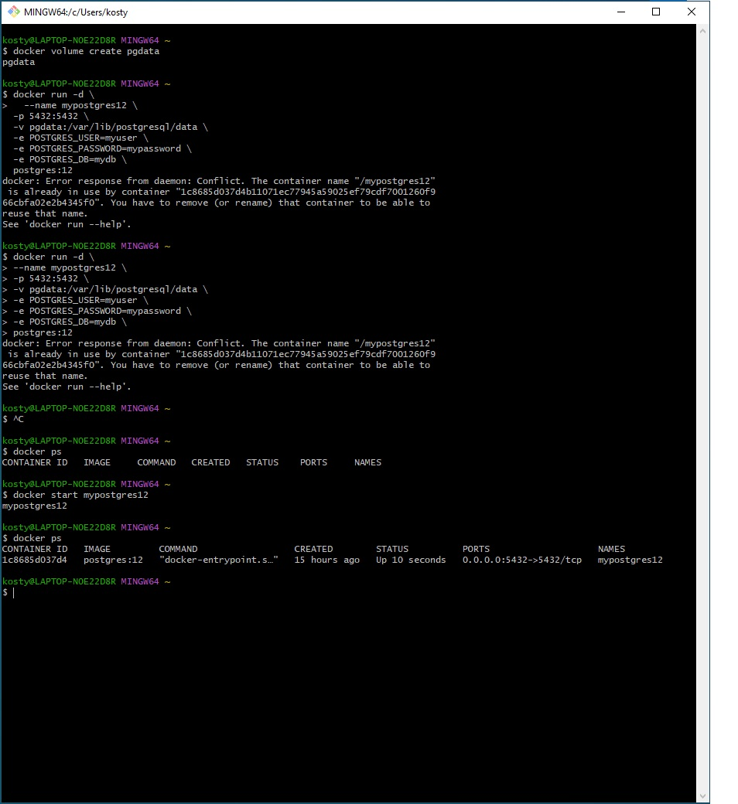
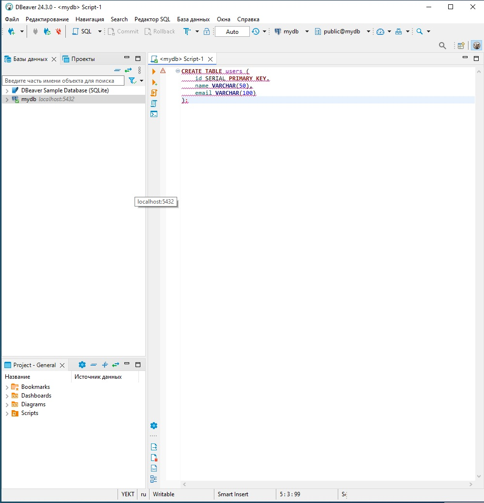
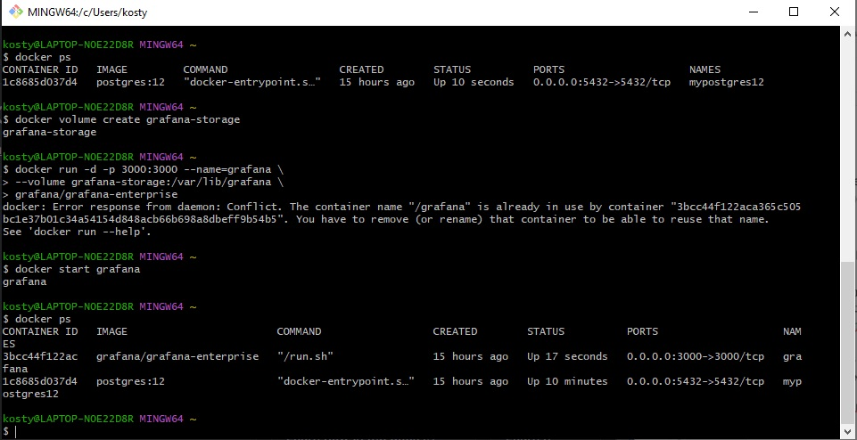
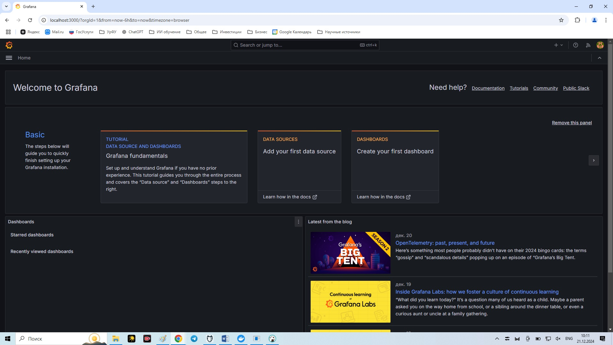
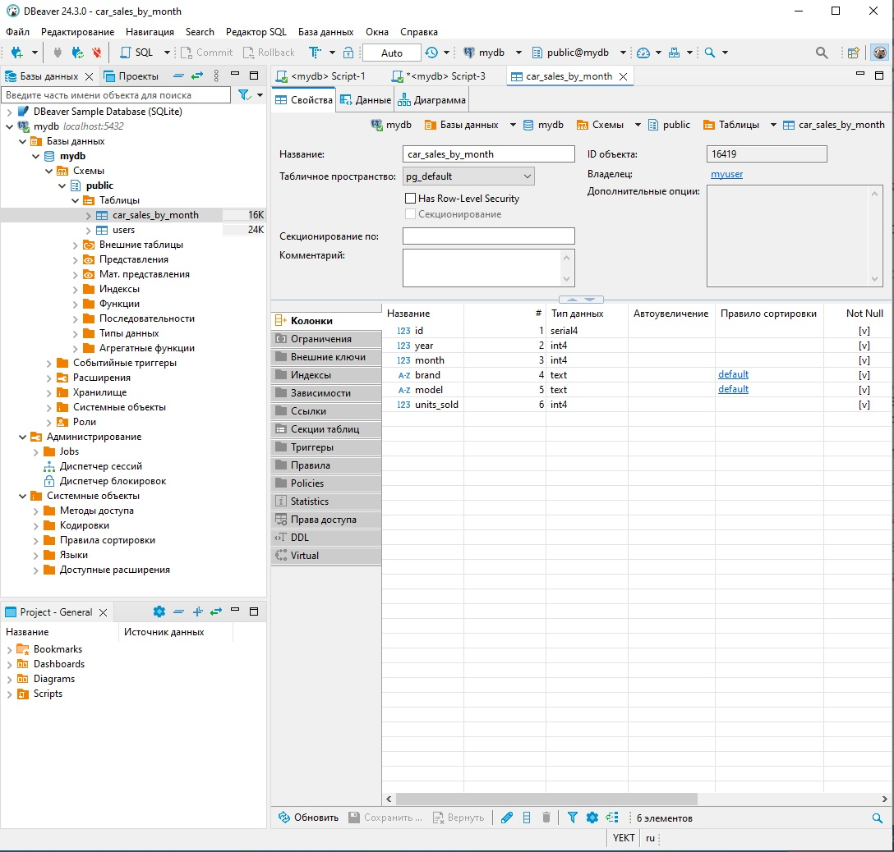
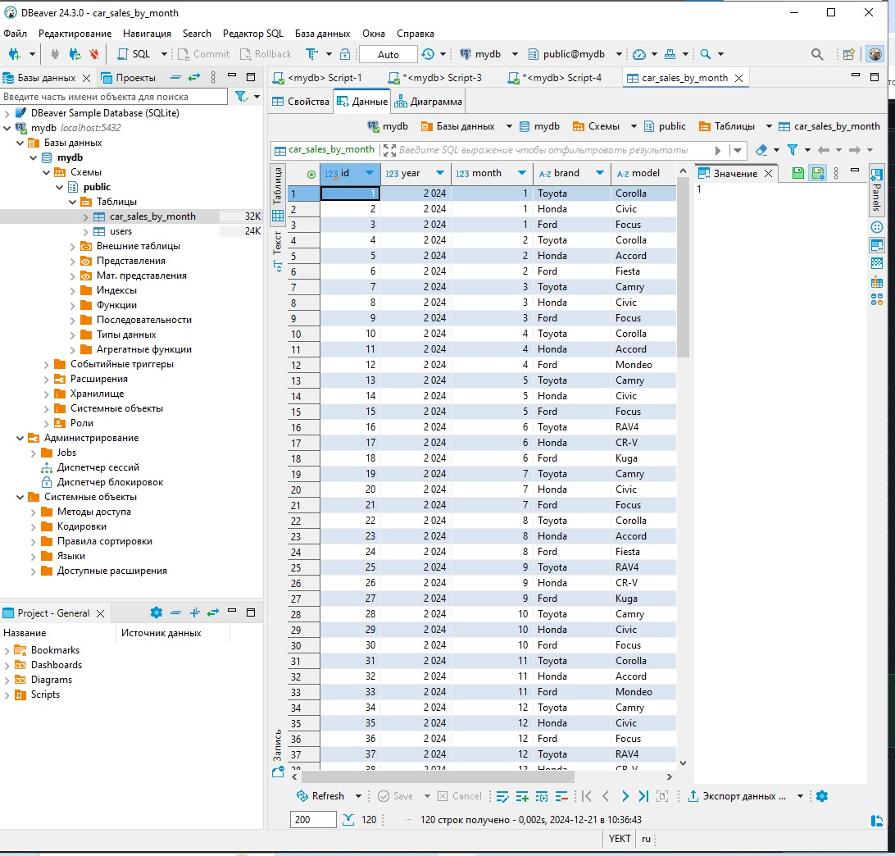
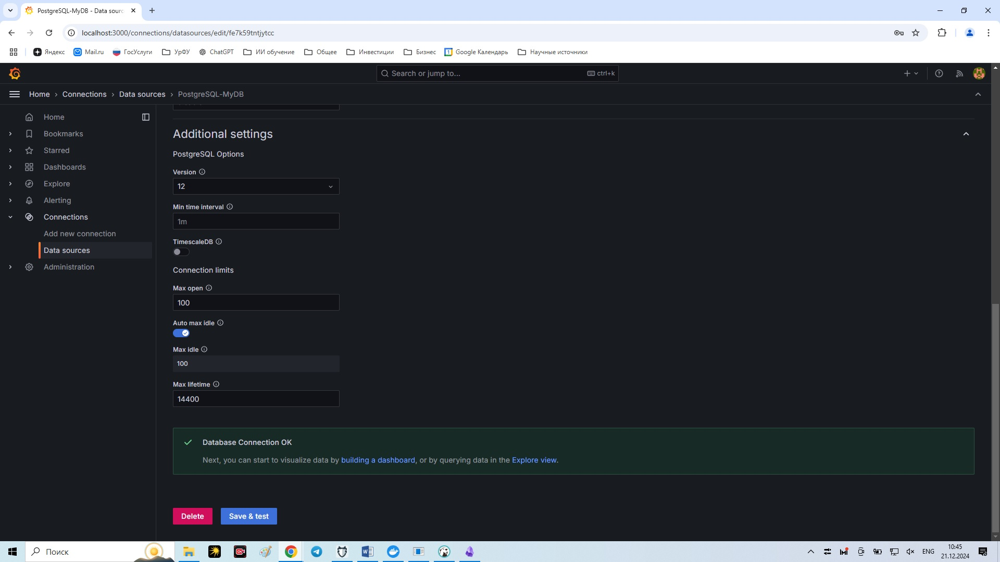
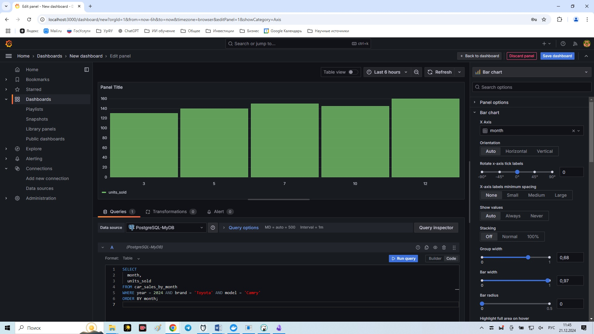

# Лабораторная работа к вебинарам 14 и 15
Тема: Работа с системами мониторинга данных

Цель работы
Научиться развертывать инфраструктурные компоненты (PostgreSQL, Grafana) с помощью Docker, работать с базой данных (создание таблиц, вставка данных) и использовать Grafana для визуализации данных.

### Часть 1: Подъем PostgreSQL 12 через Docker

Создайте именованный том для PostgreSQL данных (опционально):
Этот шаг полезен для сохранения данных базы при остановке или удалении контейнера:

#### docker volume create pgdata

Запуск PostgreSQL 12 в контейнере Docker
Используйте следующую команду для развертывания:

docker run -d \
  --name mypostgres12 \
  -p 5432:5432 \
  -v pgdata:/var/lib/postgresql/data \
  -e POSTGRES_USER=myuser \
  -e POSTGRES_PASSWORD=mypassword \
  -e POSTGRES_DB=mydb \
  postgres:12

Убедитесь, что контейнер запущен, выполнив:
docker ps
Вы должны увидеть информацию о контейнере, включая имя mypostgres12 и порт 5432.
и проверьте доступ к базе данных

### Часть 2: Запуск Grafana через Docker

В этом разделе вы развернёте Grafana, инструмент для визуализации данных, используя Docker
Для сохранения данных Grafana (например, настроек дашбордов) после остановки или удаления контейнера создайте именованный том:
docker volume create grafana-storage
Эта команда создаёт долговременное хранилище, которое Docker подключит к контейнеру Grafana. Данные будут сохраняться в директории /var/lib/docker/volumes/grafana-storage.
Запустите Grafana:

#### docker run -d -p 3000:3000 --name=grafana \
  --volume grafana-storage:/var/lib/grafana \
  grafana/grafana-enterprise

Перейдите в браузере по адресу http://localhost:3000.
Логин и пароль по умолчанию: admin / admin (вас попросят сменить пароль при первом входе).

### Часть 3: Создание таблицы в PostgreSQL

Подключитесь к PostgreSQL (через psql):

#### psql -h localhost -p 5432 -U myuser -d mydb

Создайте таблицу car_sales_by_month:

CREATE TABLE car_sales_by_month (
    id SERIAL PRIMARY KEY,
    year INT NOT NULL,
    month INT NOT NULL CHECK (month >= 1 AND month <= 12),
    brand TEXT NOT NULL,
    model TEXT NOT NULL,
    units_sold INT NOT NULL
);

В этой части мы создадим таблицу car_sales_by_month в базе данных mydb. Подключение будем делать через DBeaver, как и указано. Вот подробное руководство:
1. Убедитесь, что PostgreSQL запущен

Перед подключением проверьте, работает ли контейнер mypostgres12:

#### docker ps

Если контейнер не работает, запустите его:

#### docker start mypostgres12

###  Часть 4: Вставка данных о продажах за 2024 год

Вставьте данные о продажах (например, для различных моделей, включая Toyota Camry):

INSERT INTO car_sales_by_month (year, month, brand, model, units_sold)
VALUES
(2024, 1, 'Toyota', 'Corolla', 120),
(2024, 1, 'Honda', 'Civic', 95),
(2024, 1, 'Ford', 'Focus', 50),
...
(2024, 12, 'Ford', 'Kuga', 55),
(2024, 12, 'Honda', 'HR-V', 78);

###   Часть 5: Подключение Grafana к PostgreSQL и построение дашборда
В интерфейсе Grafana (http://localhost:3000):

●	Войдите под admin.

●	Перейдите в "Configuration" -> "Data Sources".

●	Добавьте новый Data Source:

Type: PostgreSQL

Host: host.docker.internal или localhost

Port: 5432

Database: mydb

User: myuser

Password: mypassword

Протестируйте соединение и сохраните источник данных.

Создайте новый дашборд:

●	Dashboards -> New dashboard -> Add a new panel.
●	В панели выберите ваш PostgreSQL Data Source.

В поле Query введите SQL запрос на выборку суммарных продаж Toyota Camry за 2024 год по месяцам:

SELECT 
  month, 
  units_sold 
FROM car_sales_by_month
WHERE year = 2024 AND brand = 'Toyota' AND model = 'Camry'
ORDER BY month;

●	Настройте тип визуализации (Line chart или Bar chart).

●	Сохраните дашборд.

●	В итоге вы должны увидеть график продаж Toyota Camry по месяцам за 2024 год.

