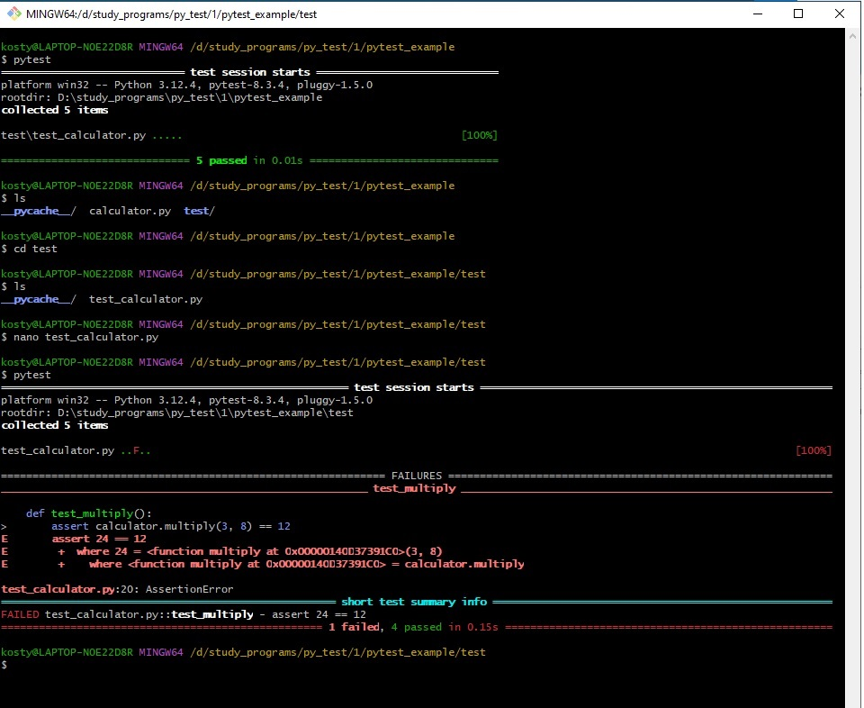
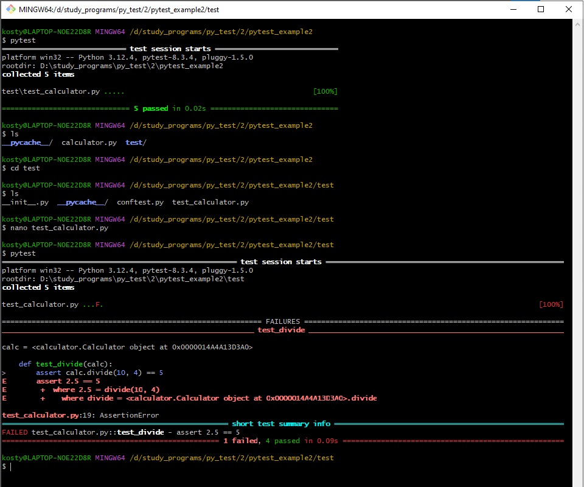
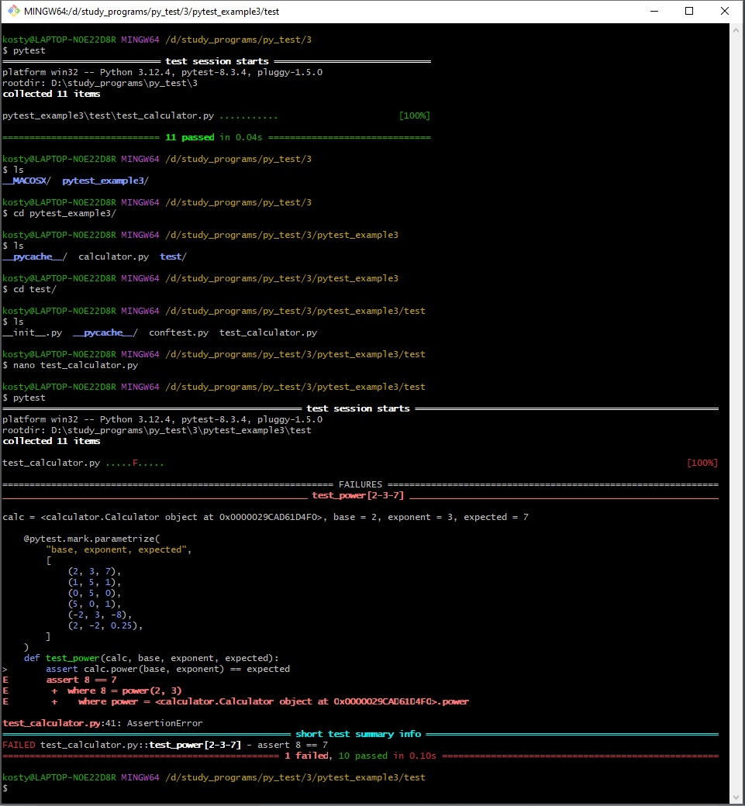
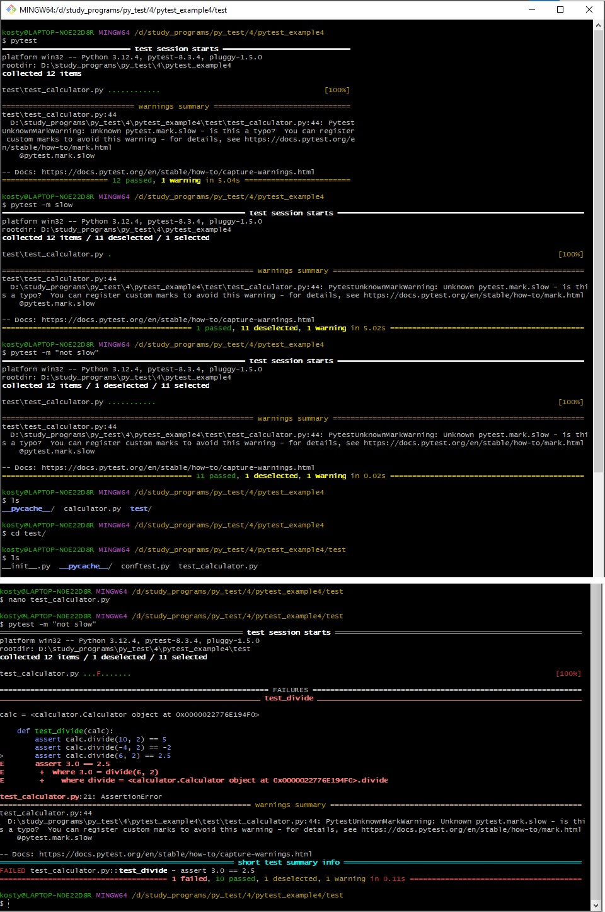
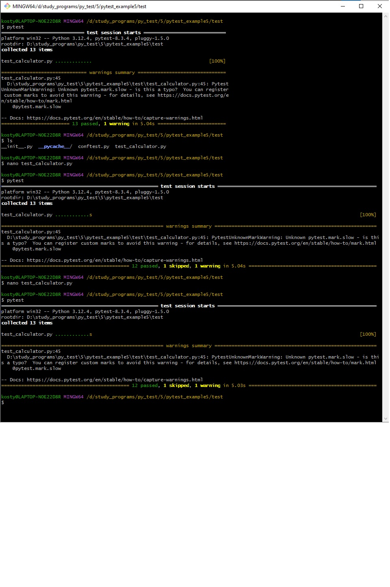
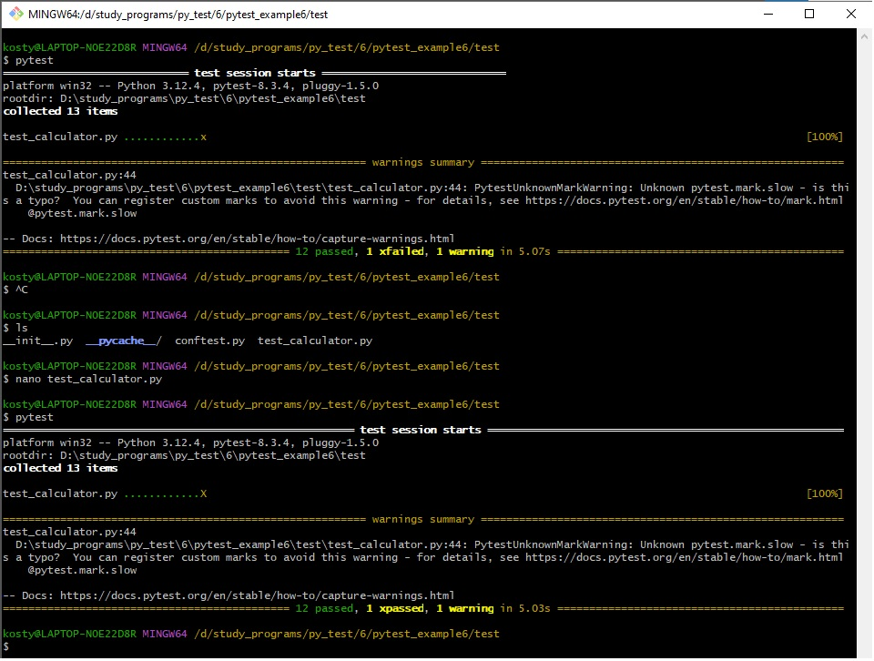

# Лабораторная работа к вебинару 16
# Тема: Инструмент pytest

### Упражнение 1. Написание простых тестов с использованием утверждений (assertions).

Цели

● Научиться писать простые тестовые функции в pytest

● Понять, как использовать оператор assert для проверки условий

Описание задачи

Создать простую функцию и написать несколько тестов для неё, используя assert
для проверки результатов

Внесены изменения в проверку умножения. Тестирование выявило ошибку.

### Упражнение 2. Использование фикстур

Цели

● Разобраться, что такое фикстуры в pytest

● Научиться создавать и использовать фикстуры для настройки тестового окружения

Описание задачи

Создать фикстуру, которая будет предоставлять объект калькулятора для тестов, чтобы избежать
повторяющегося кода и улучшить организацию тестов

Внесены изменения в проверку деления. Тестирование выявило ошибку.

### Упражнение 3. Параметризация тестов

Цель

Научиться использовать параметризацию в pytest для запуска тестов с различными входными данными

Описание задачи

Протестировать функцию возведения числа в степень с различными наборами данных

Внесены изменения в проверку возведения в степень. Тестирование выявило ошибку.

###  Упражнение 4. Маркировка тестов и пропуск тестов

Цель

Узнать, как маркировать тесты и пропускать их при определённых условиях

Описание задачи

Отметить некоторые тесты как медленные и научиться их пропускать при запуске тестов

Выполнены запуски тестирования с пропуском медленного действия и наоборот, с выполнением только медленного действия.
Потом внесены изменения в процесс деления и тест выдал ошибку.

###   Упражнение 5. Маркировка тестов и пропуск тестов

Цель

Узнать, как маркировать тесты и пропускать их при определённых условиях

Описание задачи

Отметить некоторые тесты как пропуск тестов условно и научиться их пропускать при запуске тестов

Выполнена тестирования с маскировкой. Результат показал, что 1 действие было замаскированно.

### Упражнение 6. Маркировка тестов и пропуск тестов

Цель

Узнать, как маркировать тесты и пропускать их при определённых условиях

Описание задачи

Отметить некоторые тесты как «тест временно не проходит» и научиться их пропускать 
при запуске тестов

Внесено изменение в заведомо ложный процесс (сделал верным решение) и при повторном тестировании результат показал 1 xpassed

### Упражнение 7. Обработка исключений

Вместо деления на 0 заменил на обычное деление. Результат: ошибка, потому что нет исключения.