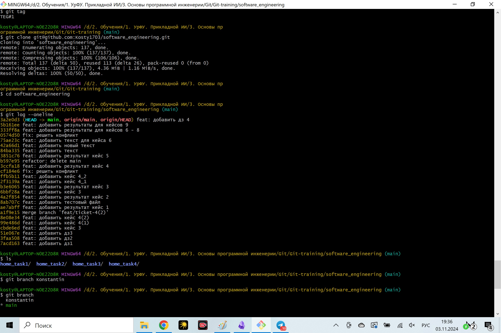
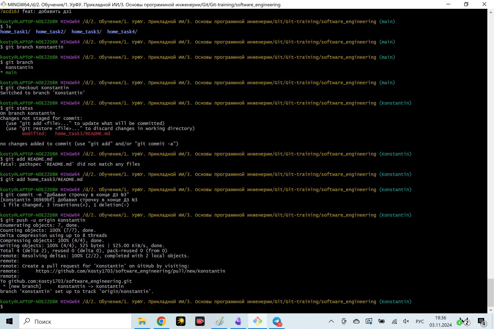
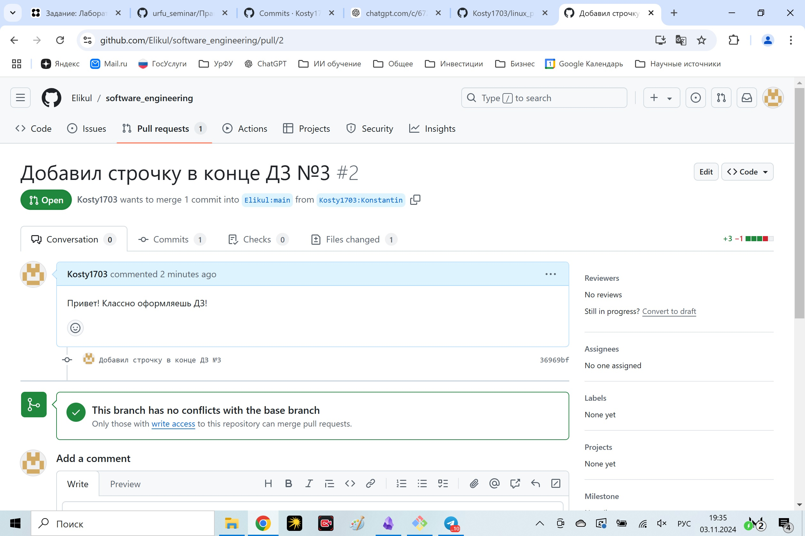

Кейс 1.
1. Создан новый репозиторий.
2. Выполнено копирование на локальный ПК:

Кейс 3.
Создал новую ветку, перешел в нее и теперь вношу изменения в файл в новой ветке.
Сейчас сделаю коммит.

Кейс 4.
Вношу изменения во вторую ветку. Посмотрим как сработает конфликт. 
Сейчас буду делать слияние ветки study_branch2 с main и после буду слияние делать этой ветки с главной
Создал новую ветку study_branch2.
Внес изменения в данный файл.
Сейчас выполню слияние с веткой main.

Переход к прошлому коммиту
=======
Кейс 9.
Все кейсы опробованы. Прикладываю скрины последнего, 9 кейса.

ДЗ выполнено!