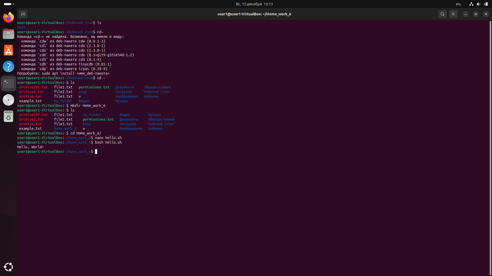
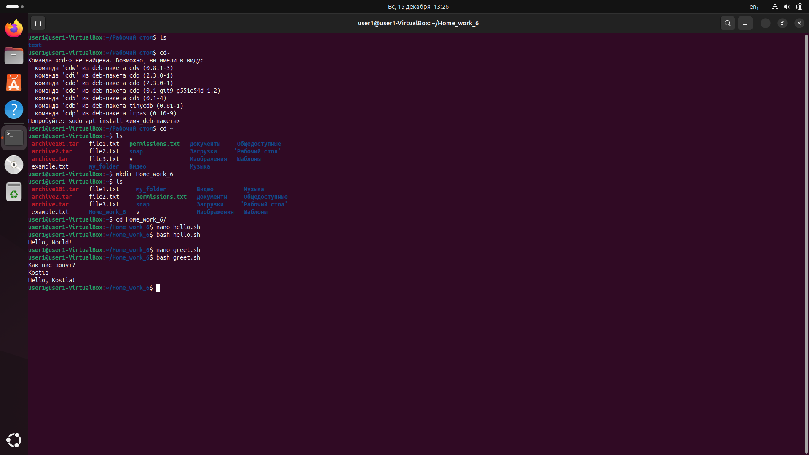
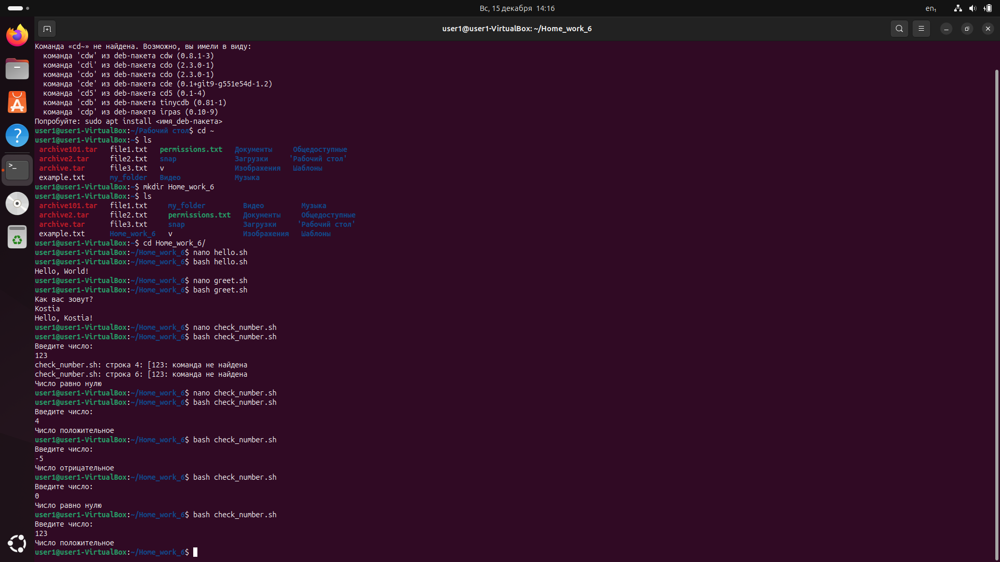
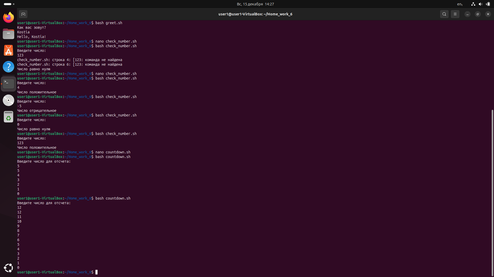
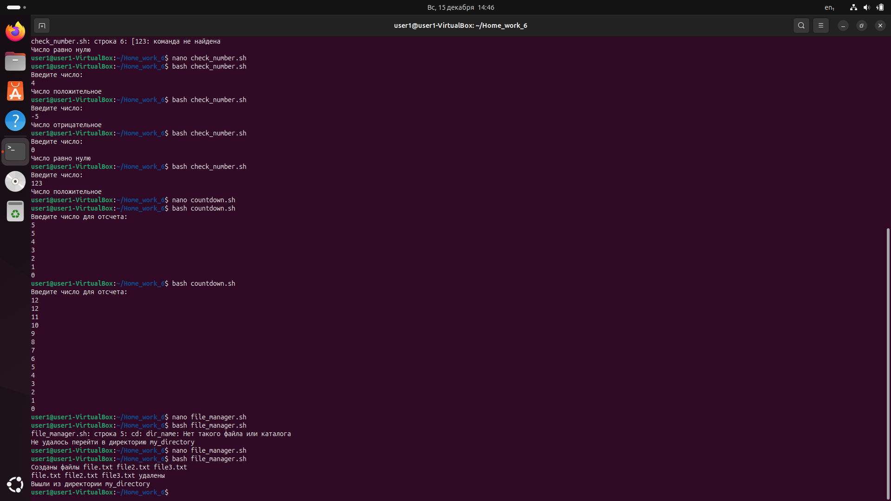

# Лабораторная работа к вебинару 6
##### В лабораторной работе вам нужно будет закрепить работы с Bash. 
Выполните задания 1-4, указанные по ссылке.

### Кейс 1: Написание простого скрипта
Задание:
1. Написать скрипт hello.sh, который выводит на экран "Hello, World!".
Ожидаемый результат:
● Скрипт hello.sh создан и выводит "Hello, World!" при запуске.

### Кейс 2: Работа с переменными
Задание:
1. Написать скрипт greet.sh, который запрашивает имя пользователя и
приветствует его по имени.
Ожидаемый результат:
● Скрипт greet.sh запрашивает имя и выводит приветствие, например, "Hello,
John!".

### Кейс 3: Условные операторы
Задание:
1. Написать скрипт check_number.sh, который запрашивает у пользователя
число и выводит сообщение о том, положительное это число, отрицательное
или ноль.
Ожидаемый результат:
● Скрипт check_number.sh корректно определяет и выводит сообщение о знаке
введенного числа.

### Кейс 4: Циклы
Задание:
1. Написать скрипт countdown.sh, который принимает число в качестве
аргумента и выводит обратный отсчет от этого числа до нуля.
Ожидаемый результат:
● Скрипт

### Кейс 5: Работа с файлами и каталогами
Задание:
1. Написать скрипт file_manager.sh, который создает директорию, переходит в
нее, создает внутри несколько файлов, затем удаляет их и выходит из
директории.
Ожидаемый результат:
● Скрипт file_manager.sh создает и удаляет файлы в указанной директории.

