# Лабораторная работа к вебинарам 7 и 8
##### В лабораторной работе вам нужно будет закрепить работы с Bash. 
Выполните задания 6-10, указанные по ссылке.

### Кейс 6: Обработка аргументов командной строки
Задание:
1. Написать скрипт sum.sh, который принимает два числа в качестве аргументов
командной строки и выводит их сумму.
Ожидаемый результат:
● Скрипт sum.sh корректно принимает аргументы и выводит их сумму.

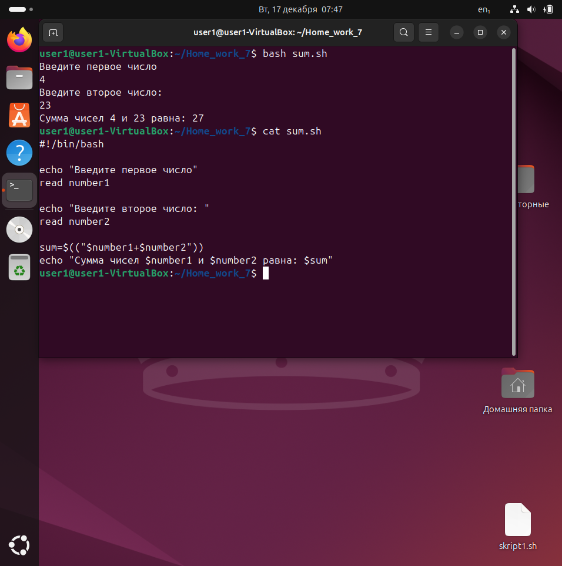

### Кейс 7: Чтение из файла
Задание:
1. Написать скрипт read_file.sh, который читает содержимое файла строка за
строкой и выводит их на экран.
Ожидаемый результат:
● Скрипт read_file.sh корректно читает и выводит содержимое файла.

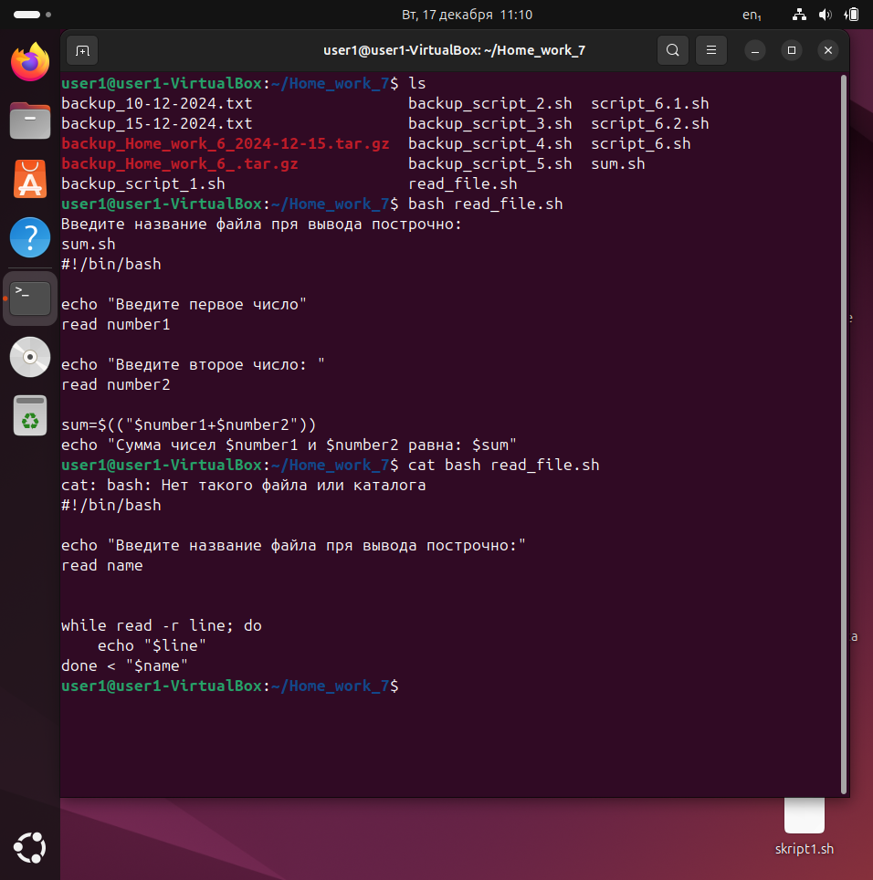

### Кейс 8: Редактирование файлов
Задание:
1. Написать скрипт replace_text.sh, который заменяет все вхождения
определенного слова в файле на другое слово.
Ожидаемый результат:
● Скрипт replace_text.sh корректно выполняет замену текста в файле.

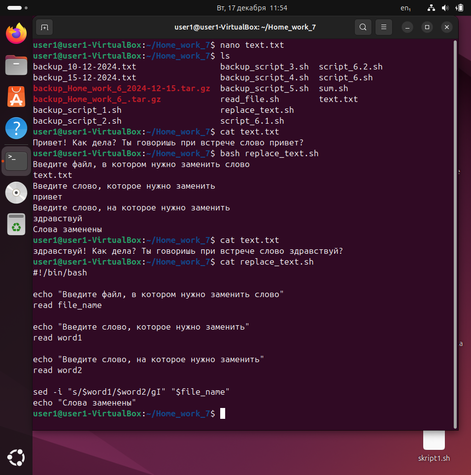

### Кейс 9: Автоматизация задач
Задание:
1. Написать скрипт backup.sh, который копирует все файлы из одной директории
в другую и добавляет текущую дату к имени каждого файла.
Ожидаемый результат:
● Скрипт backup.sh корректно выполняет резервное копирование файлов с
добавлением даты к имени.

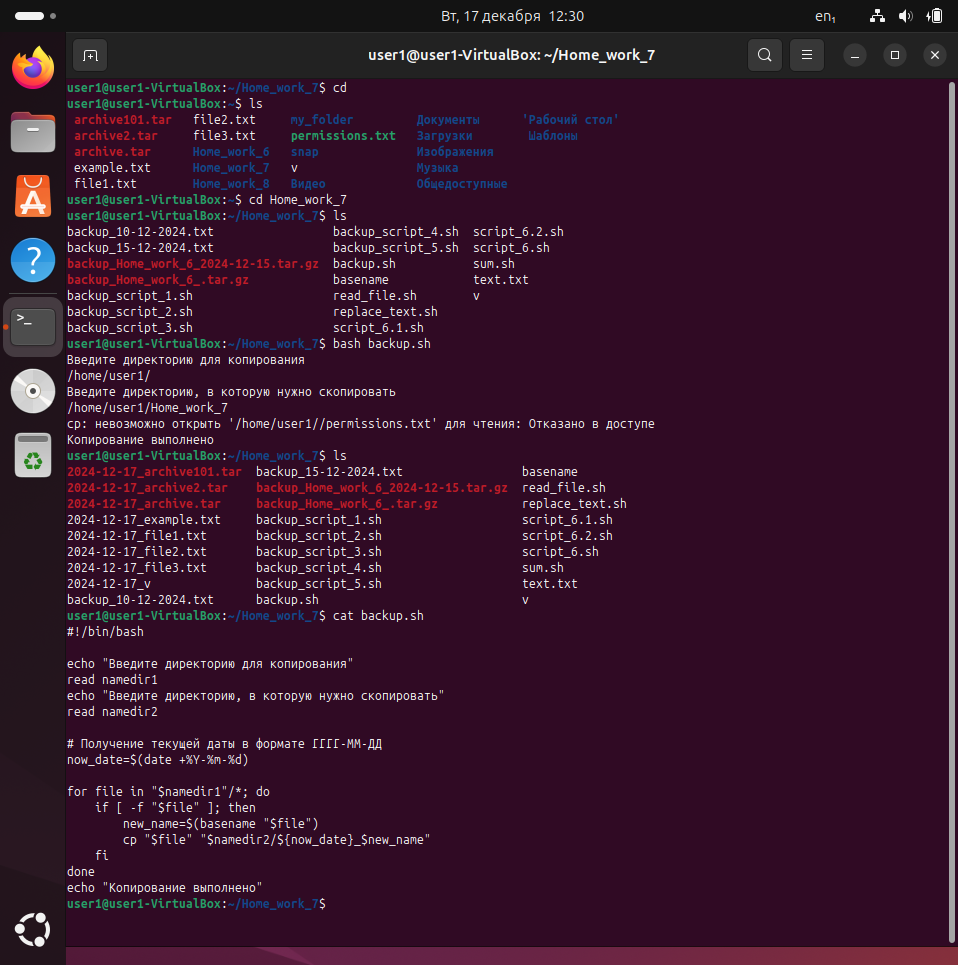

### Кейс 10: Использование функций
Задание:
1. Написать скрипт math_operations.sh, который содержит функции для
сложения, вычитания, умножения и деления двух чисел. Скрипт должен
запрашивать у пользователя два числа и операцию, которую нужно выполнить.
Ожидаемый результат:
● Скрипт math_operations.sh корректно выполняет математические операции
с использованием функций.

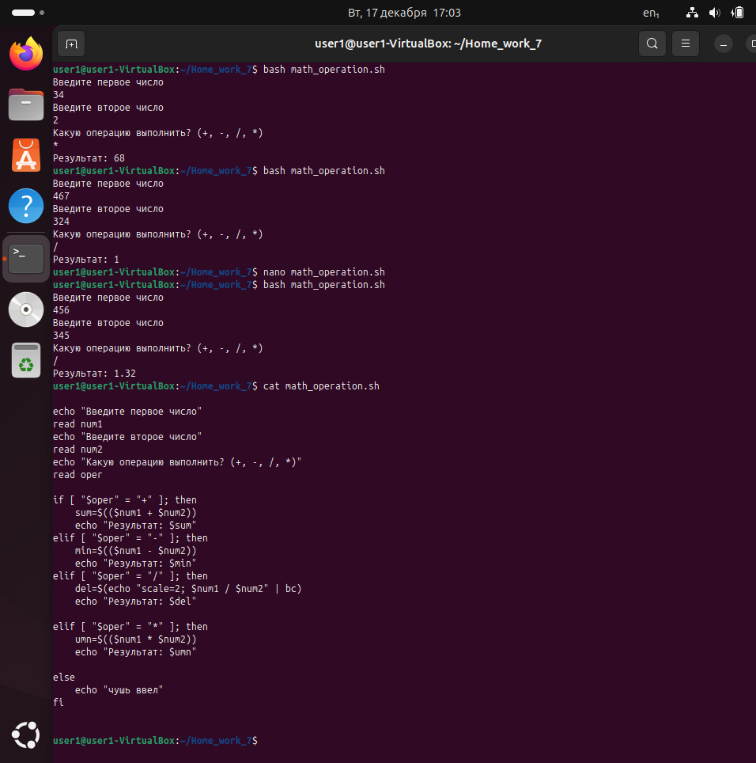

# Задания, выполненные на лекциях

### Упражнение 1
Основные команды Bash
Задание
Напишите скрипт, который запрашивает у пользователя его имя и возраст,
а затем выводит сообщение:
«Привет, [имя]! Через год тебе будет [возраст + 1] лет.»

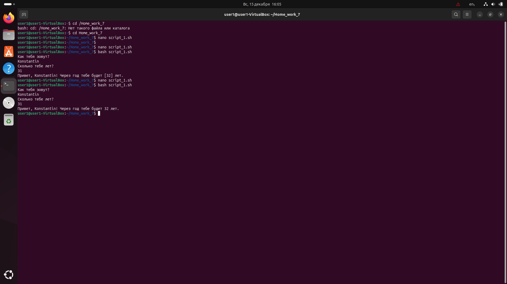
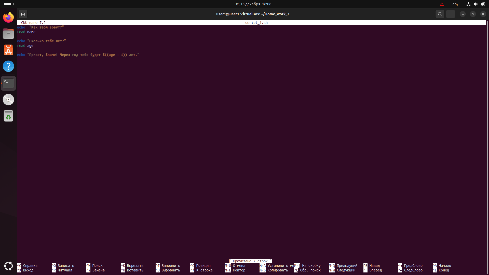

### Упражнение 2
Основные команды Bash
Задание
Напишите скрипт, который проверяет, существует ли файл,
указанный пользователем. Если файл существует, должно выводиться:
«Файл найден!»
Если нет — «Файл не найден.

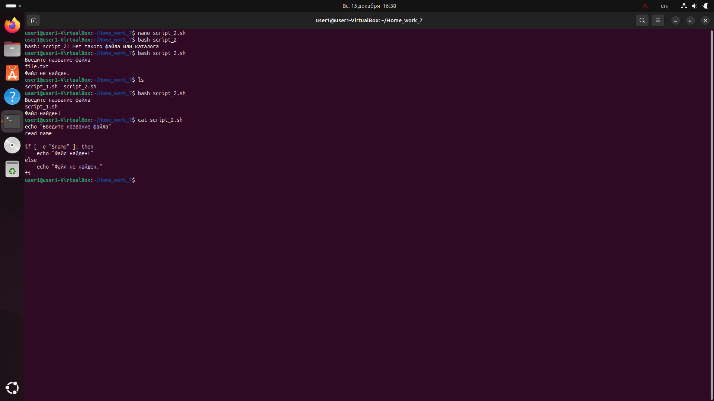

### Упражнение 3
Основные команды Bash
Задание
Скрипт должен создавать архив (tar.gz) для указанной директории.
Имя архива должно включать текущую дату.

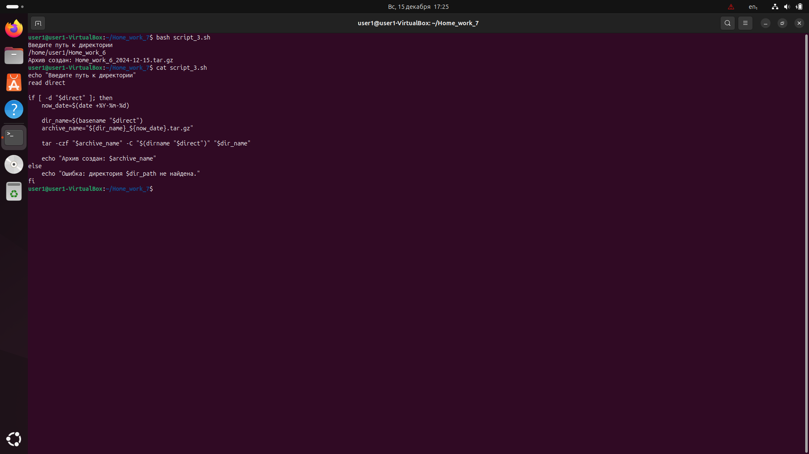

### Упражнение 4
Основные команды Bash
Задание
Напишите скрипт, который принимает на вход имя файла
и выводит количество строк в нём.

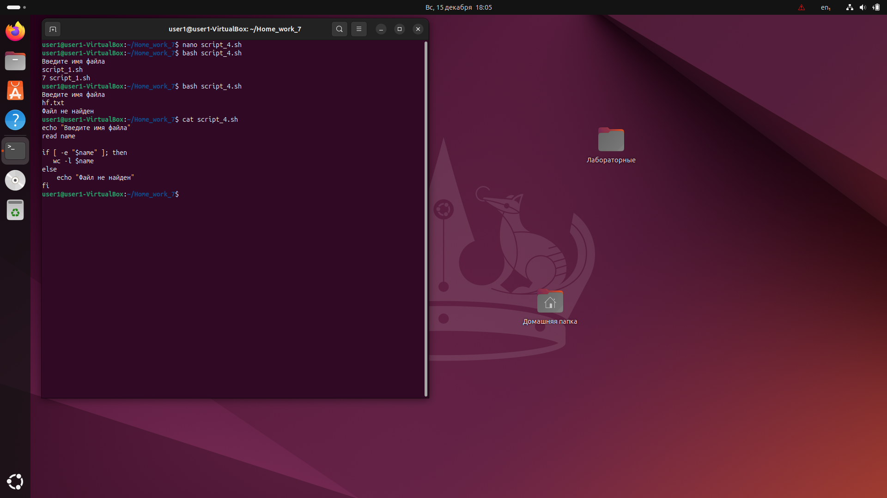

### Упражнение 5
Основные команды Bash
Задание
Напишите скрипт, который добавляет префикс backup_ ко всем файлам
в указанной директории.

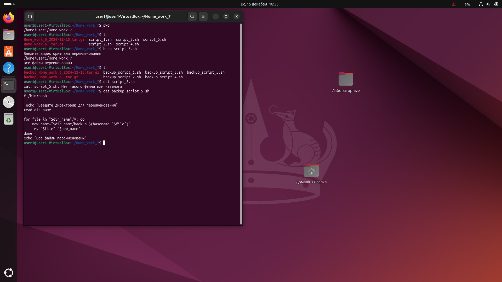

### Упражнение 6
Основные команды Bash
Задание
Напишите скрипт, удаляющий все файлы в директории,
которые были изменены более 7 дней назад.

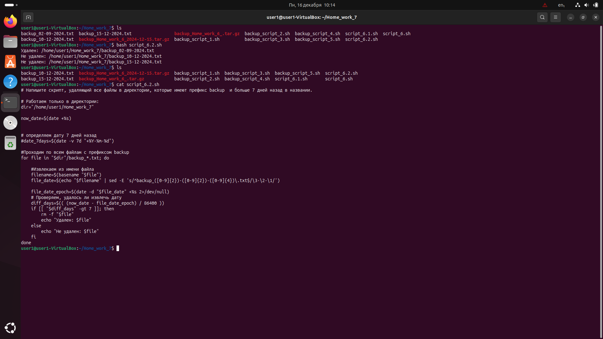