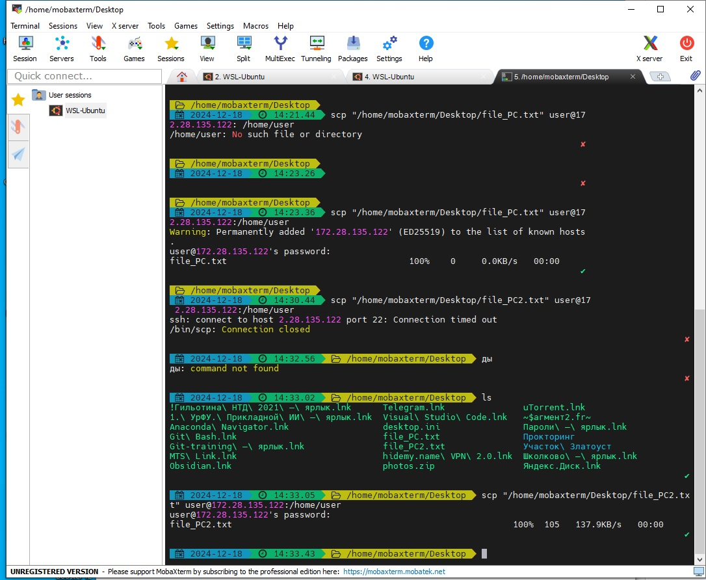
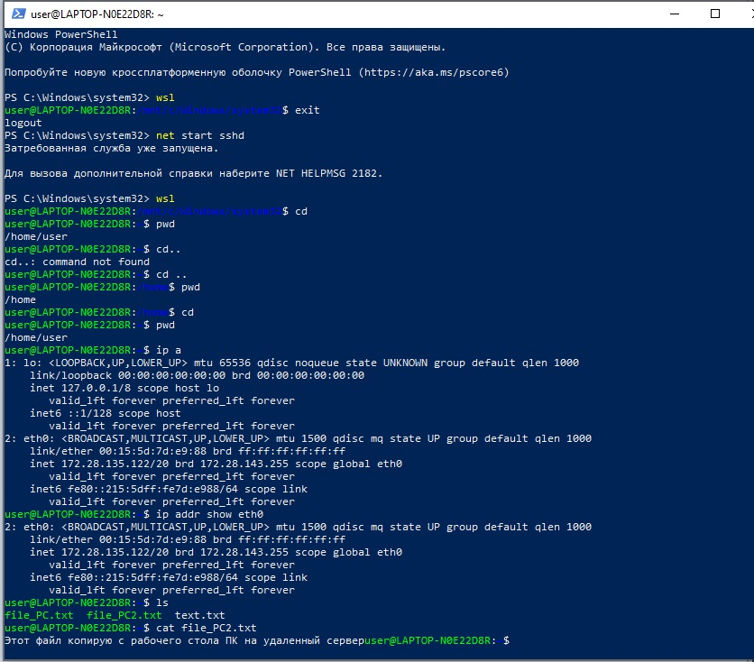
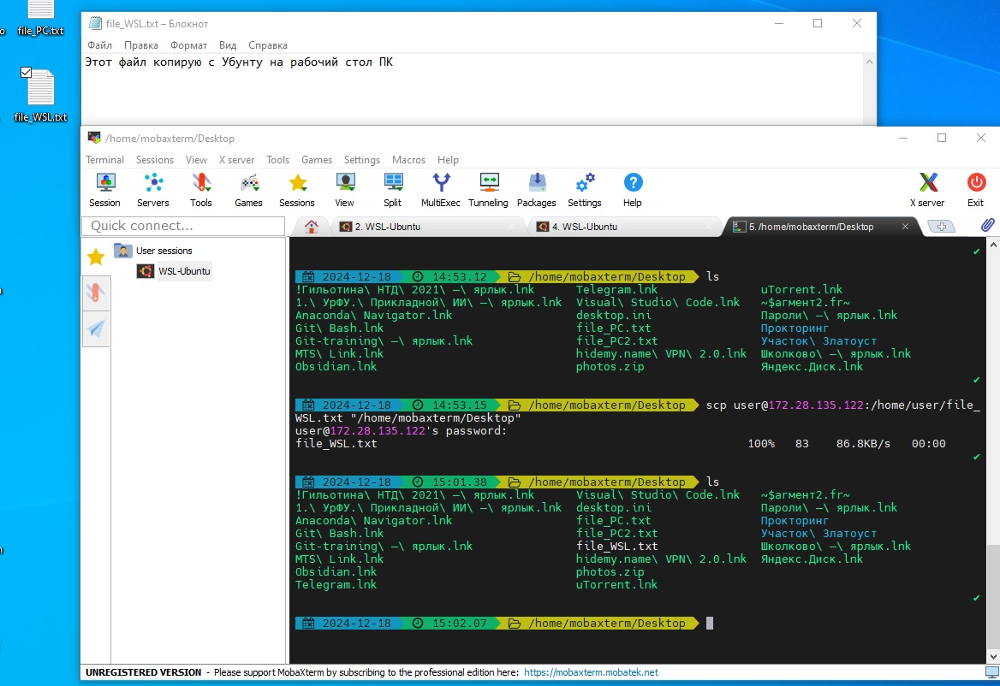

# Лабораторная работа к вебинарам 9 и 10
Преподаватель сказал делать с 1 по 3 кейсы.

### Кейс 1: Установка и настройка SSH-сервера
Задание:
1. Установить SSH-сервер на виртуальную машину (например, с помощью sudo
apt-get install openssh-server).
2. Настроить SSH-сервер, убедиться, что он запущен, и проверить его статус.
Ожидаемый результат:
● SSH-сервер установлен и запущен.
● Статус SSH-сервера проверен и отображается как "running".

### Кейс 2: Подключение к удаленному серверу
Задание:
1. Использовать команду ssh для подключения к удаленному серверу.
2. Подключиться к серверу с использованием имени пользователя и IP-адреса
(например, ssh user@192.168.1.100).
Ожидаемый результат:
● Успешное подключение к удаленному серверу через SSH.

### Кейс 3: Копирование файлов с помощью SCP
Задание:
1. Использовать команду scp для копирования файла с локальной машины на
удаленный сервер.
2. Копировать файл с удаленного сервера на локальную машину.
Ожидаемый результат:
● Файл успешно скопирован на удаленный сервер и обратно на локальную
машину.

