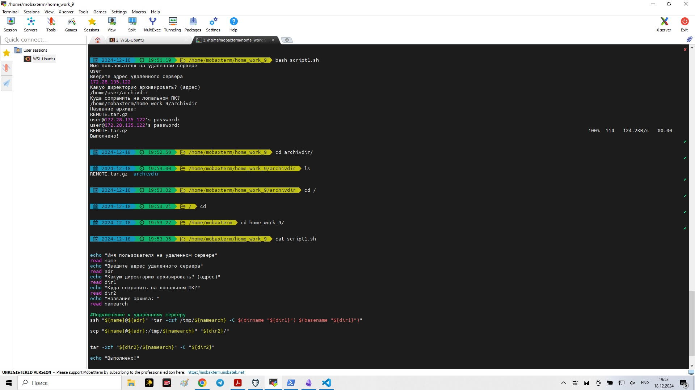
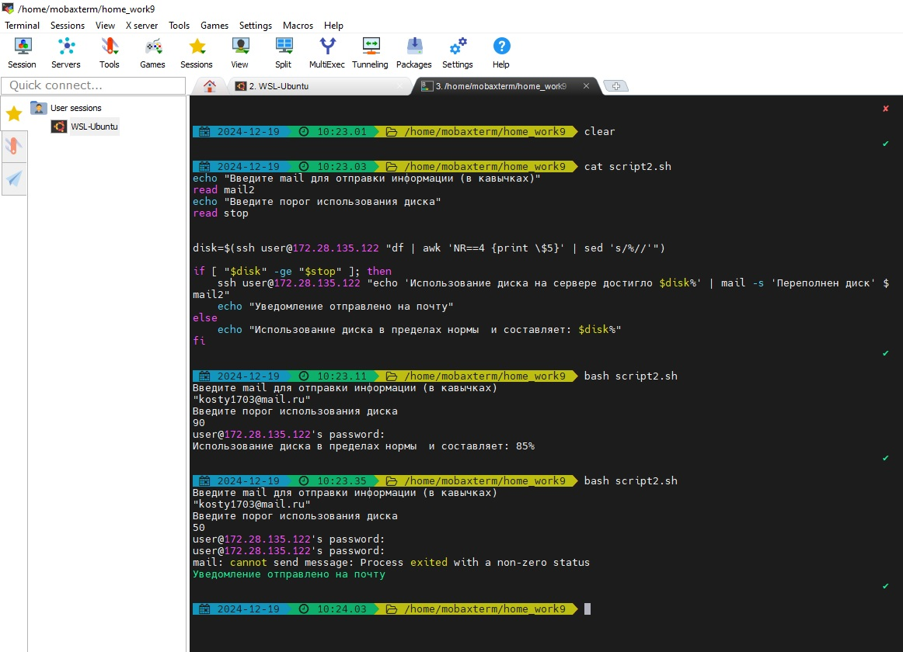
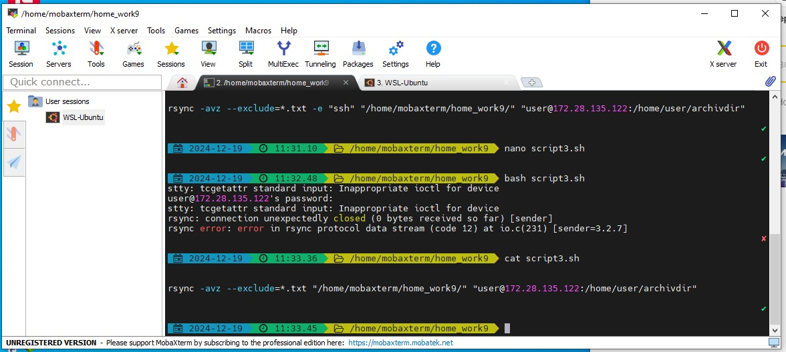

# Лабораторная работа к вебинару 11

### Задание 1: Архивирование файлов и скачивание с сервера с последующим разархивированием
Описание задания

Написать Bash-скрипт, который:
1. Подключается к удалённому серверу по SSH.
2. Архивирует указанную директорию на удаленном сервере.
3. Скачивает созданный архив на локальную машину с помощью scp.
4. Разархивирует архив на локальной машине.

### Задание 2: Мониторинг свободного места на сервере
Описание задания

Написать Bash-скрипт, который:
1. Подключается к удалённому серверу по SSH.
2. Проверяет процент использования дискового пространства.
3. Если использование превышает заданный порог, отправляет уведомление по
электронной почте.

### Задание 3: Синхронизация файлов между локальной машиной и удалённым сервером
Описание задания

Написать Bash-скрипт, который:
1. Синхронизирует файлы между локальной директорией и удаленной с
использованием rsync по SSH.
2. Игнорирует определённые типы файлов или директории.

Код вроде правильный, но не работает. По разному пробовал. Возможно какая-то проблемма с синхронизацей mobaXterm и ПК

Дальше буду разбираться...
